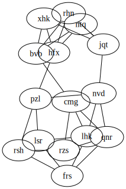

This one is a bit weird, in that it uses your eyes to solve it. The solution comes in two parts

```
go run main.go inputfile dot
```

will get you a DOT representation of the graph. If you pipe this into `neato`, you can visually see the separation.

You then input the nodes to "cut" into the `cut` subcommand. For instance, this is how you would execute the sample

```
go run main.go inputfile cut htj,pcc dlk,pjj bbg,htb
```

Here is an example SVG of the sample input, to demonstrate how you would pick out "htj-pcc", "dlk-pjj", "bbg-htb"


